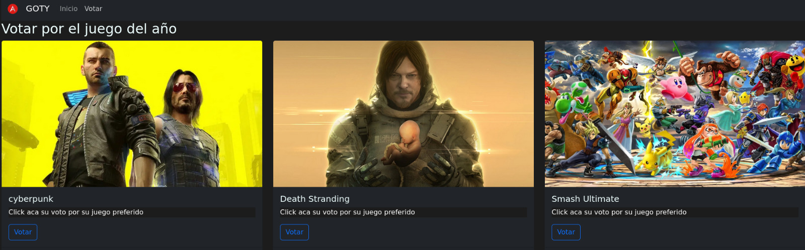
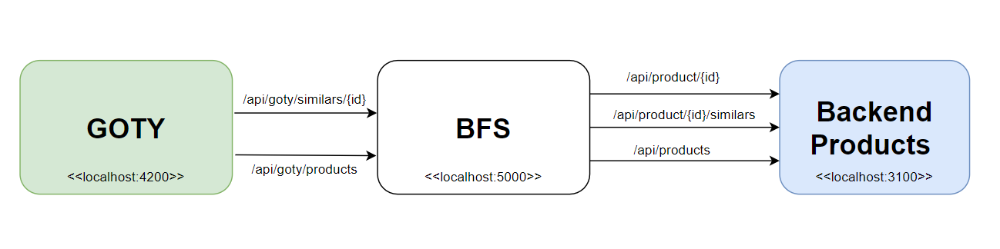

# The Game Of Year 
### Backend for frontend(BFS)
 
- The most important video game webpage wants to know the best Video Game Of the Year (GOTY), so it builds an online survey to see the winner. It shows some candidates to get the awards, and on the first page, it offers a bar chart with some voting trends. 

- When the application was deployed, it had a lot of issues associated with the performance; your mission is to try to fix all and get help to the video games community. Are you ready to do it? Let's get into the challenge. 

## The Challenge 
* You will by build a web service to fix the issue of the current, web service. you'll have to do two endpoints, the first one get all the games and the second one get the games asocited by candidate.  

 
## Rules
1.  You can use the first functionality (get all) only to fill the content of the first view of the votation page; any other business logic will be allowed. 

2. You will be focused on improving the performance and resilience of the second functionality,  It will get the information about the associated games in a list way.

## Prerequisites 

* ***Docker***: you need install it to deploy the proyect. 
* ***Command line***: you need it to execute the performance commands to enable the project. 

## Commands 
 
These commands allow deploy the main components of the project: 

1. **Enable Backend and Frontend** 
+ docker-compose up -d influxdb backend_bfs mocksserver goty-front  
2. **Disable Backend and Frontend** 
+ docker-compose stop influxdb backend_bfs  mocksserver goty-front   
3. **Execute performance tests**
+ docker-compose run --rm k6  

## The Backend

* 
The main backend gets three funcionalities and you can get data across this endpoint: 

1. It gets the details by game (numbers one to six): 
 
**verb**: GET  
**end-point**: http://localhost:3100/api/product/{id}

2. It gets a list of associates' games by the candidate: 
 
**verb**: GET  
**end-point**: http://localhost:3100/api/product/{id}/similars

3. It gets a list of all games: 
 
**verb**: GET  
**end-point**: http://localhost:3100/api/products
